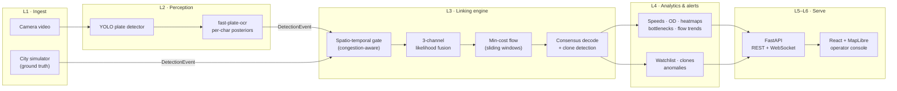

<div align="center">

# UrbanTrace

### City-scale vehicle tracking that reasons in probabilities, not string matches.

An AI engine for city-wide ANPR networks: it fuses noisy plate reads, vehicle appearance and travel time
into vehicle journeys, traffic analytics and real-time alerts.


**IDF1 0.972 vs 0.875** for exact plate matching on a congested 20,000-vehicle city day ·
**9× fewer identity errors** · **94.3% per-character OCR** on held-out real Indian plates ·
runs offline on a laptop, no cloud APIs


<sub>Built for Smart India Hackathon problem SIH26127 (Bharat Electronics Ltd.) —
<a href="docs/PRD.md">problem statement</a></sub>

</div>

---

## Why this exists

Every ANPR camera in a city emits isolated reads — `(camera, time, plate guess, confidence, vehicle crop)`.
Nothing joins them into one vehicle's journey. The standard fix is to match plate strings exactly across
cameras, and it breaks the moment a single character is misread — angle, blur, night glare, a truck in the
way. In real deployments that happens constantly.

**UrbanTrace changes the question.** Instead of *"are these two strings equal?"* it asks *"how likely is it
that these two reads are the same vehicle?"* — and answers with three independent pieces of evidence:

| Evidence | What it measures |
|---|---|
| **Plate** | Character-by-character agreement between two OCR *probability distributions*, not their best guesses. An unreadable character counts as zero evidence, never as a mismatch. |
| **Appearance** | How alike the two vehicle crops look, as a calibrated same-vs-different likelihood ratio. |
| **Travel time** | Whether the gap between the two cameras is plausible on the road network at that time of day — learned per camera pair, congestion-aware, with physically impossible trips rejected outright. |

Each is a log-likelihood ratio, so they simply add. A **min-cost-flow** solver then picks the set of
journeys that best explains every read in the city at once, with one rule enforced by construction: each
read belongs to exactly one vehicle. Once journeys exist, the reads along them are fused, so linking
**repairs** the OCR instead of depending on it.

## What it does

The four components the problem statement asks for, all working end to end:

| | Component | What UrbanTrace delivers |
|---|---|---|
| 1 | **Deep-learning plate OCR** | YOLO plate detector + fast-plate-ocr, both fine-tuned on real Indian plates; per-character probabilities with calibrated confidence (ECE 0.041). |
| 2 | **Trajectory reconstruction** | Multi-camera journeys on a GIS map with timestamps and direction of travel, a *WHY panel* that breaks every link into its evidence, consensus plate repair, and partial-plate search (`RJ78IV23??`). |
| 3 | **Traffic analytics dashboard** | Density and speed heatmaps (live), average speeds per corridor, origin–destination matrix, route volumes, flow trends and a congestion-bottleneck ranking. |
| 4 | **Real-time alerts** | Probabilistic watchlist (catches a blacklisted vehicle even when one camera misreads it), cloned-plate detection, impossible-travel and route-anomaly alerts, streamed over WebSocket. |

## Results at a glance

| | Result | Evidence |
|---|---|---|
| Tracking accuracy (congested city day, 103,475 reads) | **IDF1 0.972** vs 0.875 for exact matching | [`trajectory_metrics.json`](eval/reports/trajectory_metrics.json) |
| Identity errors | **2,143** vs 19,214 | same |
| Robustness when half of all plate reads are wrong | **0.980** vs 0.553 | [`stress_sweep.json`](eval/reports/stress_sweep.json) |
| OCR on 276 held-out real Indian plates | **94.3%** per character · **81.0%** whole plate | [`ocr_real_fpo_finetuned.json`](eval/reports/ocr_real_fpo_finetuned.json) |
| Plate repair by fusing 4+ camera reads | 87.8% → **99.95%** | [`consensus_accuracy.json`](eval/reports/consensus_accuracy.json) |
| Cloned plates (two cars, one plate string) | fused AUC **0.998** vs 0.477 plate-only | [`stratified_auc.json`](eval/reports/stratified_auc.json) |

Nothing is tuned on what it is scored on, and the weak spots are reported alongside the strong ones — see
[Results](#results) and [Honest limitations](#honest-limitations) below.

## A look inside

<table>
<tr>
<td width="50%"><br><sub><b>A journey, explained.</b> Eight cameras saw this car and three misread its plate; fusing the reads recovers <code>RJ78IV2345</code> at 99.95%. Every link shows its plate, appearance and travel-time evidence.</sub></td>
<td width="50%"><br><sub><b>A cloned plate, caught.</b> The same plate 591 m apart in 11 s would need 185 km/h, and the two vehicles look different: two cars, one plate.</sub></td>
</tr>
<tr>
<td width="50%"><br><sub><b>City analytics</b> from the same journeys: volumes, origin–destination flows, speed trends and congestion bottlenecks.</sub></td>
<td width="50%"><br><sub><b>Evidence in the app.</b> The Results page renders every report in <code>eval/reports/</code>, starting with OCR on real Indian plates.</sub></td>
</tr>
</table>

## Architecture



Perception and linking are separated by one hard contract, `DetectionEvent` ([`engine/contracts/`](engine/contracts/)):
the linking engine neither knows nor cares whether a read came from a real camera or the simulator. The
simulator is what makes the tracking claims measurable — no public dataset provides city-wide
multi-camera plate reads *with* the true vehicle journeys. Its noise is pinned to published real-world
figures, with tests that fail the build if it drifts.

The API and UI run as a single process: `uvicorn api.main:app` serves REST under `/api`, the live replay
under `/ws/live` and the built console at `/`, over SQLite. Full design and maths:
[`docs/architecture.md`](docs/architecture.md). Every non-obvious choice and why:
[`docs/decisions.md`](docs/decisions.md).

## Tech stack

| Layer | Tools |
|---|---|
| Linking engine | Python 3.12, NumPy, SciPy; own successive-shortest-path min-cost-flow solver (checked against NetworkX) |
| Perception | Ultralytics YOLO (plate detection), fast-plate-ocr (recognition), PyTorch (own CRNN baseline) |
| API | FastAPI, WebSocket replay, SQLAlchemy + SQLite |
| Console | React, TypeScript, Vite, Tailwind, MapLibre GL, Recharts, TanStack Query |
| Quality | pytest (460+ tests), ruff, oxlint, GitHub Actions |

## Quickstart — Windows, no Docker

Requires Python 3.12+ and Node 22+.

```powershell
python -m venv .venv
.venv\Scripts\pip install -e ".[dev]"     # or just -e . to only serve/simulate/ingest (no scipy/sklearn/pytest)

# Keep the SQLite DB OFF the OneDrive-synced project folder -- see Troubleshooting.
$env:URBANTRACE_DB_PATH = "$env:LOCALAPPDATA\urbantrace\urbantrace.db"
New-Item -ItemType Directory -Force -Path (Split-Path $env:URBANTRACE_DB_PATH) | Out-Null

# 1. Generate a small demo dataset (25 cameras, 4,000 vehicles, 6 simulated hours -- a few minutes).
python -m sim.generate --cameras 25 --vehicles 4000 --hours 6 --seed 42 --out data/run1

# 2. Run the real linking pipeline (gate -> fuse -> min-cost flow) and get the UrbanTrace-vs-baseline scoreboard.
python -m eval.run_pipeline --data data/run1 --out data/run1/pipeline

# 3. Load events + trajectories into SQLite.
python -m api.ingest --data data/run1 --trajectories data/run1/pipeline/trajectories.jsonl --db $env:URBANTRACE_DB_PATH

# 4. Build the UI against the real API, then serve everything from one process.
cd web
npm install
npm run build
cd ..
python -m uvicorn api.main:app --port 8000
```

Open http://localhost:8000.

Skipping step 2 (and passing `--build-demo` instead of `--trajectories ...` in step 3) links events
in-process instead of via `eval/run_pipeline.py` — faster, but you won't get the baseline-comparison
report. See `api/ingest.py`'s module docstring.

An equivalent task runner exists for both shells:

```powershell
./make.ps1 setup
./make.ps1 sim         # -Cameras / -Vehicles / -Hours / -Seed to override
./make.ps1 pipeline
./make.ps1 ingest
./make.ps1 serve
```

```bash
make setup
make sim          # CAMERAS=50 VEHICLES=20000 HOURS=24 for the full target-scale run
make pipeline
make ingest
make serve
```

## Quickstart — Docker

Requires Docker Desktop (with Compose v2) running.

```bash
# One-time: generate a small demo dataset (25 cameras, 4,000 vehicles, 6h -- a few minutes)
# and ingest it into the named volume the app container reads from.
docker compose --profile seed run --rm seed

# Build and start the app (API + UI in one container, port 8000).
docker compose up --build urbantrace
```

or with the task runner: `make docker-seed && make docker-up` / `./make.ps1 docker-seed` then
`./make.ps1 docker-up`.

Open http://localhost:8000. The SQLite DB lives on the named Docker volume `urbantrace-db`, never on a bind
mount into this folder — see **Troubleshooting**.

To reseed from scratch: `docker compose down -v` (removes the volume) then repeat the two commands
above.

## Where the evidence lives

`eval/reports/*.json` — generated by the scripts in `eval/`, and served verbatim (keyed by file stem) by
`GET /api/eval`, which the UI's **Results** page renders:

| File | What it shows |
|---|---|
| `trajectory_metrics.json` | The headline scoreboard: UrbanTrace vs. Baseline A (exact plate-string match, same spatio-temporal gate) — IDF1, ID-precision/recall, ID-switches, fragmentation, trajectory completeness (from `eval/run_pipeline.py`) |
| `trajectory_metrics_prefix.json` | The same, on a time-prefix of the dataset (`--max-hours`) — a quick timing/sanity check before committing to a full run |
| `stratified_auc.json` | The stratum x channel AUC matrix (architecture.md §8): plate-only vs. fused, across the *routine*, *clone*, *degraded*, and *plate-similar* strata — the load-bearing evidence that fusion, not just the plate channel, is doing the work |
| `clone_overlap_auc.json` | Clone-detection performance split by route-overlap difficulty |
| `consensus_accuracy.json` | Plate-repair accuracy: consensus decode vs. single reads |
| `appearance_scaling.json` | How the appearance (Re-ID) channel's discriminative power scales |
| `gating.json` / `blocking.json` | Candidate-recall and pruning stats for the spatio-temporal gate (and the plate-based overflow blocker) |
| `error_analysis.json` | Breakdown of the pipeline's remaining failure modes |

## Results

Every number below traces to a file in `eval/reports/`. Nothing is tuned on what it is scored on: priors, the link threshold and the congestion model are calibrated on separate simulated days with different random seeds, and the OCR is scored once on real plates held out by plate string.

### 1. OCR on real Indian plates (`ocr_real_fpo_finetuned.json`) — PRD component 1

Held-out real test set: **510 images / 276 unique plates**, never seen in training (the team's real Indian dataset, split by plate so no car appears in both training and test).

| Model | Whole plate | Per character | Per unique plate |
|---|---|---|---|
| Our own CRNN, synthetic training only | 9.2% | 51.5% | 8.0% |
| Our own CRNN, + real fine-tune (60 epochs) | 44.3% | 73.8% | 40.2% |
| fast-plate-ocr pretrained, no fine-tune (no Indian plates in its training) | 51.4% | 75.9% | — |
| **fast-plate-ocr fine-tuned on real Indian plates** | **81.0%** | **94.3%** | **77.2%** |

By source: video frames 89.1%, OLX photos 78.8%, Google images 73.0%. Calibration error (ECE) 0.041.

**Against the PRD's ">90%": met per character (94.3%), not met per whole plate (81.0%).** We report both. The gap is training data — 546 unique real training plates; validation reached 88%.

### 2. Plate detection (`detector_holdout_video.json`, `detector_eval.json`)

| | Recall | mAP@0.5 |
|---|---|---|
| Close-up vehicle photos (pretrained, after an RGB-order fix) | 0.946 | 0.960 |
| **Held-out traffic video, small distant plates — pretrained** | 0.333 | 0.308 |
| **Held-out traffic video — fine-tuned on Indian scenes** | **0.506** | **0.530** |

Small, distant plates in general traffic footage are the system's main real-world weakness. The held-out video is small (50 frames, 35 plates) — indicative, not precise.

### 3. Trajectory reconstruction (`trajectory_metrics.json`) — PRD component 2

A simulated city day **with realistic rush-hour congestion**: 50 cameras, 20,000 vehicles, 24 hours, **103,475 camera reads**.

| | **UrbanTrace** | Baseline A (exact plate match) |
|---|---|---|
| **IDF1** | **0.9716** | 0.8745 |
| Identity switches | **2,143** | 19,214 |
| Fragmentation | **1,540** | — |
| Trajectory completeness | **0.982** | — |
| Journeys found (truth: 19,996) | **21,218** | 32,475 |
| Linking time on a laptop | 12 min | — |

Link threshold β = 5, chosen on a separate full-size congested training day (IDF1 there 0.969 — it transferred). On an earlier **uncongested** day the same engine scored **0.9914** (`trajectory_metrics_run1.json`); congestion makes travel time less informative, so the honest number is the congested one.

### 4. City analytics on the congested day — PRD component 3

City mean speed falls from **80 km/h at night to 65.3 km/h at 08:00 and 66.0 km/h at 17:00**; the worst corridors average 71–80% of free-flow speed over the day (congestion index 1.20–1.31). Heatmaps (density and speed), OD matrix, volumes, flow trends and a bottleneck ranking are all served live by the API.

### 5. Alerts — PRD component 4

On the congested day: **197 cloned-plate alerts**, 1 impossible-travel, 2 looping-route anomalies. Example clone: plate `KA98LM9842` seen 7.8 km apart in 139 s, when the road network needs at least 235 s — implied 203 km/h, and the two vehicles look different.

**Watchlist:** matching is probabilistic, on each read and on the vehicle's fused plate. Plate `TN15TU5117` was caught at 93% via the fused multi-camera plate at a camera whose own read did not clear the threshold alone.

### 6. Robustness — the gap grows as plates get harder to read (`stress_sweep.json`)

| Per-read plate accuracy | UrbanTrace IDF1 | Exact match IDF1 | Gap |
|---|---|---|---|
| 88.8% | 0.979 | 0.885 | 0.094 |
| 70.4% | 0.979 | 0.717 | 0.262 |
| 63.8% | 0.976 | 0.657 | 0.319 |
| 55.2% | 0.986 | 0.589 | 0.398 |
| **50.0%** | **0.980** | **0.553** | **0.427** |

When cameras **miss** vehicles instead (0% → 30%), UrbanTrace stays at 0.97–0.99 with a steady lead of ~0.09–0.11, but the gap does **not** widen — the widening is specific to plate-reading errors. *(Run on smaller uncongested cities.)*

### 7. Baselines, ablation and fusion by case

*(These use smaller uncongested cities, to isolate each effect.)*

| System (`baselines.json`) | IDF1 |
|---|---|
| A — exact plate match | 0.875 |
| B — fuzzy match (≤ 1 character different) | 0.952 |
| C — fuzzy + **hard** travel-time window | 0.863 |

Baseline C is *worse* than B: a hard travel-time rule rejects genuine links whenever a vehicle dawdles.

| Evidence used (`ablation.json`) | IDF1 |
|---|---|
| Plate only | 0.968 |
| Plate + travel time | 0.977 |
| Plate + appearance | 0.987 |
| **All three** | **0.992** |
| All three, greedy linking instead of the global solver | 0.991 |
| Appearance + travel time, **no plate** | 0.388 |

Every channel adds value. The global solver's accuracy margin over greedy linking is small once channels are calibrated — its value is the guarantee that one read belongs to exactly one vehicle. Appearance and travel time support the plate; they can't replace it.

| Case (`stratified_auc.json`, `clone_overlap_auc.json`) | Plate only | Appearance | Travel time | **Fused** |
|---|---|---|---|---|
| Routine traffic | 1.000 | 0.998 | 0.860 | **1.000** |
| **Cloned plates** | **0.477** | 0.997 | 0.960 | **0.998** |
| Near-identical plates | 0.923 | 0.998 | 1.000 | **1.000** |

With two vehicles sharing one plate string, plate evidence alone is a coin flip; fusion still separates them.

| Camera reads fused (`consensus_accuracy.json`) | Single read | **After fusion** |
|---|---|---|
| 3 | 87.8% | **98.3%** |
| 4 or more | 87.8% | **99.95%** |

### Honest limitations

- **OCR whole-plate accuracy is 81.0%**, below the PRD's 90% (per character 94.3% is above). More real training plates is the lever.
- **Small, distant plates in general traffic footage:** detector recall 0.51 on a held-out video. ANPR-positioned cameras would help most.
- **Tracking over-splits:** 21,218 journeys for 19,996 vehicles on the congested day. We prefer that to over-merging, which would invent journeys that never happened.
- **The tracking evaluation is simulated**, pinned to published real-world figures (per-read plate accuracy 85–95%, appearance re-identification ~70% at benchmark scale, rush-hour bottlenecks at ~40–60% of free-flow speed) with tests that fail if the noise drifts. Every simulated trip starts and ends at the city boundary, so the grid interior carries little traffic.
- **Licensing:** the detector library (Ultralytics) is AGPL-3.0 — fine for a prototype; production needs a commercial licence or an Apache-licensed detector.
- **The Docker image has never been built** — the daemon would not start on the development machine. The non-Docker quickstart is verified end to end.


## Tests

```bash
./.venv/Scripts/python.exe -m pytest      # or `make test` / `./make.ps1 test`
```

Frontend checks (from `web/`):

```bash
npx tsc --noEmit -p tsconfig.app.json     # type check
npm run lint                              # oxlint
npm run build                             # full build
```

Lint (Python): `./.venv/Scripts/python.exe -m ruff check .` (or `make lint` / `./make.ps1 lint`, which
also runs the web linter).

## Troubleshooting

**Everything (generate/ingest/serve) is painfully slow, especially SQLite writes.**
This project folder lives inside OneDrive. OneDrive's background sync makes disk I/O on files inside it
much slower than a local disk — SQLite, which does frequent small writes, feels this badly. Fix: point
`URBANTRACE_DB_PATH` at a location *outside* OneDrive, e.g. `%LOCALAPPDATA%\urbantrace\urbantrace.db` on Windows
(`make.ps1` does this for you automatically; the plain `Makefile`/manual commands need you to set the
env var yourself, as shown in the quickstart above). In Docker this is a non-issue: the DB lives on the
named volume `urbantrace-db`, which Docker manages outside any bind-mounted, OneDrive-synced folder — never
change `docker-compose.yml` to bind-mount `/data` into this repo.

**Where OCR training/raw data lives (`URBANTRACE_DATA_DIR`).**
Every default path in `engine/`, `eval/`, and `sim/` that points at raw datasets, detector/OCR weights, or
training runs (see `engine/paths.py`) is resolved from one setting: `URBANTRACE_DATA_DIR`, which defaults to
a repo-relative `./data` (gitignored). If your OCR/detector data lives somewhere else — e.g. an existing
`ocr/` tree outside the repo, alongside a separate OCR venv — set it before running any `engine.perception.*`
or `eval.*` script:

```powershell
$env:URBANTRACE_DATA_DIR = "C:\path\to\your\data"
```

This is independent of `URBANTRACE_DB_PATH` above (that's just the API's SQLite file); most people only
ever need to set `URBANTRACE_DATA_DIR` if they're re-running the OCR/detector training scripts against a
pre-existing dataset outside the repo.

**`docker compose up` fails to connect / hangs.**
Docker Desktop needs to be running (and fully started, not just launching) before `docker compose`
commands work. On Windows this can take a minute or two after starting the app.

**Port 8000 (or 5173) already in use.**
Something else is bound to it — stop it, or run `uvicorn api.main:app --port 8001` / edit the port
mapping in `docker-compose.yml`.

**The web build fails / behaves oddly.**
Needs Node 22+. If you see stale UI behavior after switching between mock and real API, check
`VITE_USE_MOCK` — the Docker image is always built with `VITE_USE_MOCK=false`; `npm run dev` defaults to
mock mode (see `web/README.md`).

**A full pipeline run is taking a long time.**
`eval/run_pipeline.py --max-hours N` evaluates only the first N simulated hours, for a quick timing
check before committing to a full run — see `trajectory_metrics_prefix.json` above. The full
target-scale run (50 cameras / 20,000 vehicles / 24h, architecture.md §8) is expected to take a while on
CPU; the demo dataset this README's quickstarts use (25 cameras / 4,000 vehicles / 6h) is deliberately
much smaller.

## Repo map

See [`docs/architecture.md`](docs/architecture.md) §6 for the full folder structure, and
[`docs/api-contract.md`](docs/api-contract.md) for the frozen REST/WebSocket contract both `api/` and
`web/` build against.

## Acknowledgements

- [fast-plate-ocr](https://github.com/ankandrew/fast-plate-ocr) (MIT) — the pretrained plate recogniser we fine-tuned.
- [Koushim/yolov8-license-plate-detection](https://huggingface.co/Koushim/yolov8-license-plate-detection) (MIT weights) on [Ultralytics](https://github.com/ultralytics/ultralytics) (AGPL-3.0) — the plate detector we fine-tuned.
- Public Kaggle Indian licence-plate datasets, used for OCR and detector fine-tuning and held-out evaluation. Datasets and model weights are not redistributed in this repository.
- Smart India Hackathon and Bharat Electronics Ltd. for problem statement SIH26127.

## License

[MIT](LICENSE) © 2026 Sumanth
