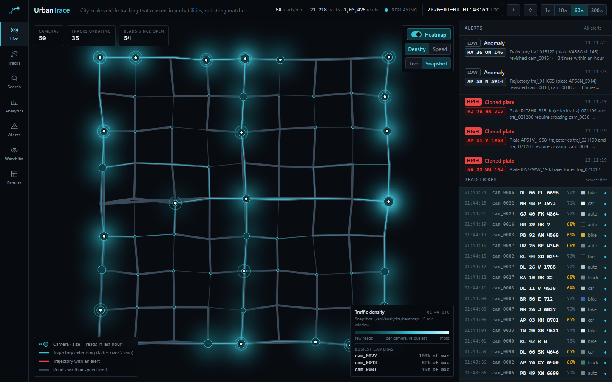
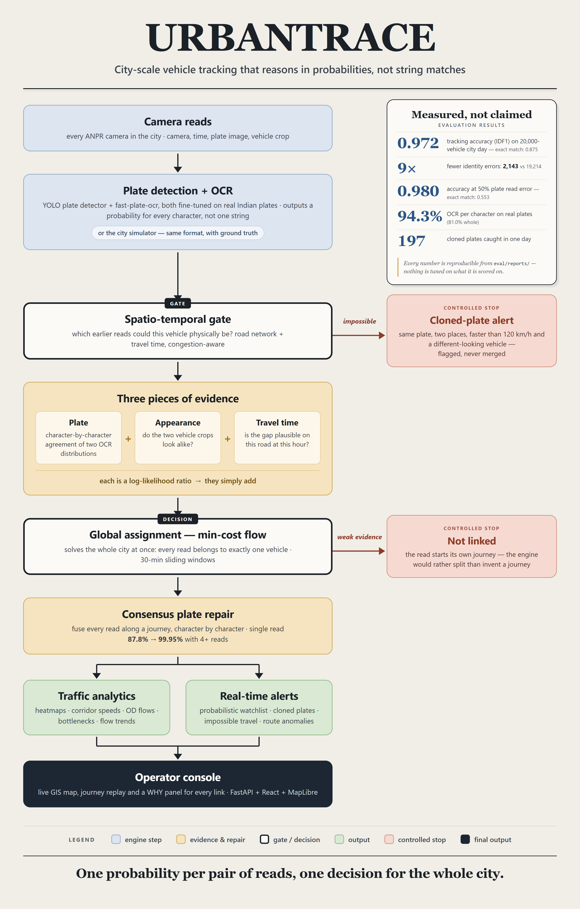
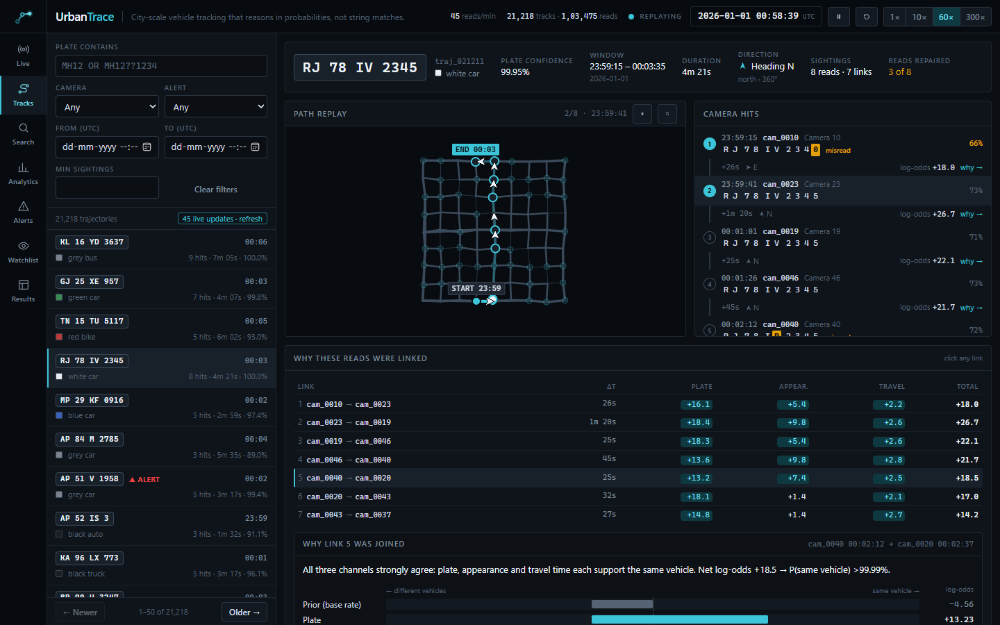
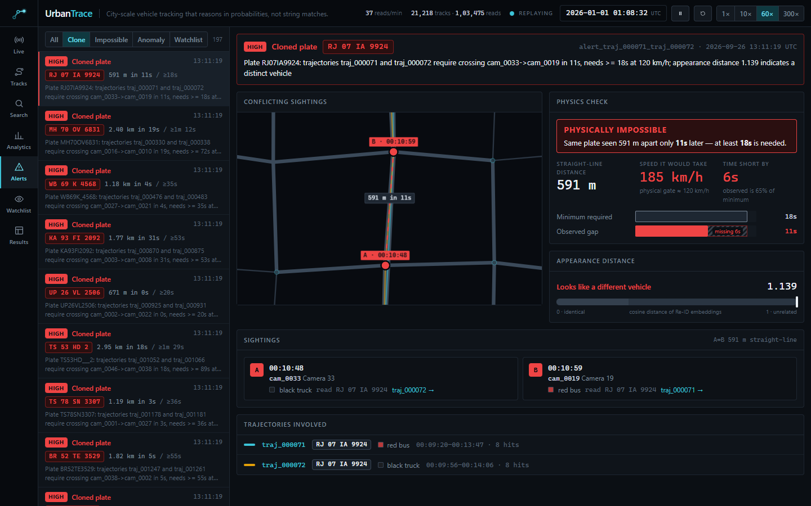
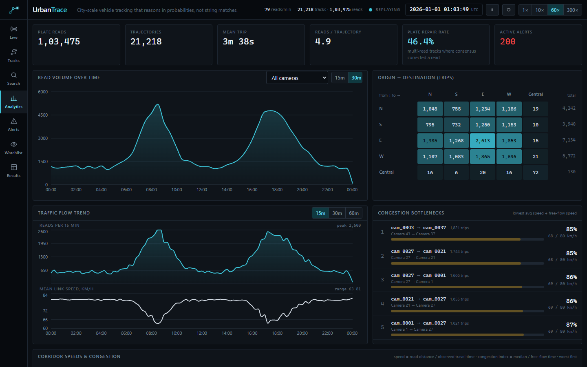
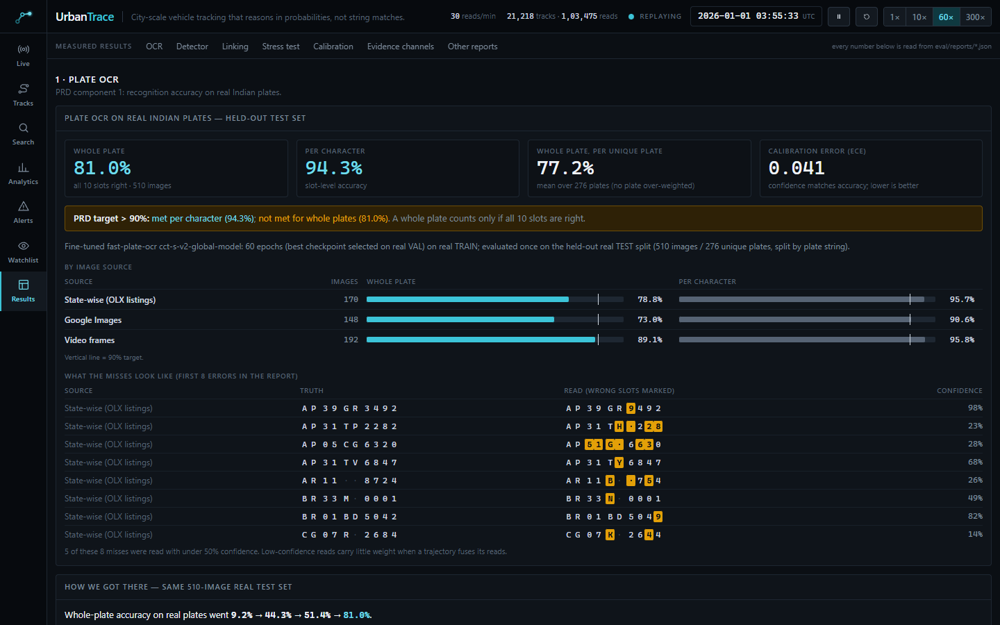

<p align="center">
  
</p>
<h3 align="center">
  <strong>City-Scale Probabilistic Vehicle Tracking</strong><br>
  <small>Multi-Camera ANPR Fusion &bull; Trajectory Reconstruction &bull; Real-Time Analytics</small>
</h3>

<p align="center">
  <a href="https://www.python.org/"></a>
  <a href="https://fastapi.tiangolo.com"></a>
  <a href="docs/backend.md#perception"></a>
  <a href="docs/architecture.md#min-cost-flow"></a>
  <a href="eval/reports/trajectory_metrics.json"></a>
  <a href="docs/frontend.md"></a>
  <a href="docs/decisions.md"></a>
  <a href="tests/"></a>
  <a href="LICENSE"></a>
</p>

<p align="center">
  City-scale vehicle tracking that reasons in probabilities, not string matches.<br>
  An AI engine for city-wide ANPR networks: it fuses noisy plate reads, vehicle appearance and travel time into vehicle journeys, traffic analytics and real-time alerts.
</p>

<p align="center"></p>

<details open>
<summary><strong>Table of Contents</strong></summary>

1. [Why this exists](#why-this-exists)
2. [How it works](#how-it-works)
3. [What it does](#what-it-does)
4. [A look inside](#a-look-inside)
5. [Results at a glance](#results-at-a-glance)
6. [Quickstart](#quickstart)
7. [Tech stack](#tech-stack)
8. [Repository](#repository)
9. [Acknowledgements](#acknowledgements)
10. [License](#license)

</details>

<p align="center"></p>

<p align="center">
  <strong>IDF1 0.972 vs 0.875</strong> for exact plate matching on a congested 20,000-vehicle city day &bull;
  <strong>9&times; fewer identity errors</strong> &bull; <strong>94.3% per-character OCR</strong> on held-out real Indian plates &bull;
  runs offline on a laptop, no cloud APIs
</p>

<p align="center">
  <a href="docs/images/live-map.png"></a>
</p>

<p align="center"></p>

## Why this exists

Every ANPR camera in a city emits isolated reads — `(camera, time, plate guess, confidence, vehicle crop)`.
Nothing joins them into one vehicle's journey. The standard fix is to match plate strings exactly across
cameras, and it breaks the moment a single character is misread — angle, blur, night glare, a truck in the
way. In real deployments that happens constantly.

**UrbanTrace changes the question.** Instead of *"are these two strings equal?"* it asks *"how likely is it
that these two reads are the same vehicle?"* — and answers with three independent pieces of evidence:

| Evidence | What it measures |
|---|---|
| **Plate** | Character-by-character agreement between two OCR *probability distributions*, not their best guesses. An unreadable character counts as zero evidence, never as a mismatch. |
| **Appearance** | How alike the two vehicle crops look, as a calibrated same-vs-different likelihood ratio. |
| **Travel time** | Whether the gap between the two cameras is plausible on the road network at that time of day — learned per camera pair, congestion-aware, with physically impossible trips rejected outright. |

Each is a log-likelihood ratio, so they simply add. A **min-cost-flow** solver then picks the set of
journeys that best explains every read in the city at once, with one rule enforced by construction: each
read belongs to exactly one vehicle. Once journeys exist, the reads along them are fused, so linking
**repairs** the OCR instead of depending on it.

## How it works

<p align="center"></p>

Perception and linking meet at a single contract, `DetectionEvent`: the linking engine cannot tell a real camera
from the city simulator. The simulator is what makes the tracking claims measurable — no public dataset has
city-wide multi-camera plate reads *with* the true journeys — and its noise is pinned to published real-world
figures by tests. Design and maths: [docs/architecture.md](docs/architecture.md) · how each side is built:
[docs/backend.md](docs/backend.md) and [docs/frontend.md](docs/frontend.md) · every non-obvious choice and why:
[docs/decisions.md](docs/decisions.md).

## What it does

The four components the problem statement asks for, all working end to end:

| | Component | What UrbanTrace delivers |
|---|---|---|
| 1 | **Deep-learning plate OCR** | YOLO plate detector + fast-plate-ocr, both fine-tuned on real Indian plates; per-character probabilities with calibrated confidence (ECE 0.041). |
| 2 | **Trajectory reconstruction** | Multi-camera journeys on a GIS map with timestamps and direction of travel, a *WHY panel* that breaks every link into its evidence, consensus plate repair, and partial-plate search (`RJ78IV23??`). |
| 3 | **Traffic analytics dashboard** | Density and speed heatmaps (live), average speeds per corridor, origin–destination matrix, route volumes, flow trends and a congestion-bottleneck ranking. |
| 4 | **Real-time alerts** | Probabilistic watchlist (catches a blacklisted vehicle even when one camera misreads it), cloned-plate detection, impossible-travel and route-anomaly alerts, streamed over WebSocket. |

## A look inside

<table>
<tr>
<td width="50%"><br><sub><b>A journey, explained.</b> Eight cameras saw this car and three misread its plate; fusing the reads recovers <code>RJ78IV2345</code> at 99.95%. Every link shows its plate, appearance and travel-time evidence.</sub></td>
<td width="50%"><br><sub><b>A cloned plate, caught.</b> The same plate 591 m apart in 11 s would need 185 km/h, and the two vehicles look different: two cars, one plate.</sub></td>
</tr>
<tr>
<td width="50%"><br><sub><b>City analytics</b> from the same journeys: volumes, origin–destination flows, speed trends and congestion bottlenecks.</sub></td>
<td width="50%"><br><sub><b>Evidence in the app.</b> The Results page renders every report in <code>eval/reports/</code>, starting with OCR on real Indian plates.</sub></td>
</tr>
</table>

## Results at a glance

| | Result | Evidence |
|---|---|---|
| Tracking accuracy (congested city day, 103,475 reads) | **IDF1 0.972** vs 0.875 for exact matching | [`trajectory_metrics.json`](eval/reports/trajectory_metrics.json) |
| Identity errors | **2,143** vs 19,214 | same |
| Robustness when half of all plate reads are wrong | **0.980** vs 0.553 | [`stress_sweep.json`](eval/reports/stress_sweep.json) |
| OCR on 276 held-out real Indian plates | **94.3%** per character · **81.0%** whole plate | [`ocr_real_fpo_finetuned.json`](eval/reports/ocr_real_fpo_finetuned.json) |
| Plate repair by fusing 4+ camera reads | 87.8% → **99.95%** | [`consensus_accuracy.json`](eval/reports/consensus_accuracy.json) |
| Cloned plates (two cars, one plate string) | fused AUC **0.998** vs 0.477 plate-only | [`stratified_auc.json`](eval/reports/stratified_auc.json) |

Nothing is tuned on what it is scored on, and the weak spots are reported alongside the strong ones — full breakdown in
[docs/results.md](docs/results.md).

### Honest limitations

- **Whole-plate OCR is 81.0%**, below the 90% target (per character, 94.3% is above it). More real training plates is the lever.
- **Small, distant plates** in general traffic footage: detector recall 0.51 on held-out video. ANPR-positioned cameras close most of this gap.
- **Tracking is evaluated in simulation**, because only a simulator gives ground-truth journeys; the OCR is measured on real plates.
- **Ultralytics (the detector library) is AGPL-3.0** — fine for a prototype, needs a commercial licence or a swap for production.

## Quickstart

Python 3.12+ and Node 22+.

```bash
python -m venv .venv && source .venv/bin/activate      # Windows: .venv\Scripts\activate
pip install -e ".[dev]"
export URBANTRACE_DB_PATH="$HOME/.urbantrace/urbantrace.db"   # keep SQLite off synced folders

python -m sim.generate --cameras 25 --vehicles 4000 --hours 6 --seed 42 --out data/run1   # a small simulated city
python -m eval.run_pipeline --data data/run1 --out data/run1/pipeline                    # link + score vs exact matching
python -m api.ingest --data data/run1 --trajectories data/run1/pipeline/trajectories.jsonl --db "$URBANTRACE_DB_PATH"
(cd web && npm ci && npm run build)
python -m uvicorn api.main:app --port 8000                                               # open http://localhost:8000
```

Or with Docker (329 MB image, API + console in one container): `docker compose --profile seed run --rm seed && docker compose up --build urbantrace`.
Windows commands, the task runners (`make` / `make.ps1`), tests and troubleshooting: [docs/setup.md](docs/setup.md).

## Tech stack

| Area | Technologies | Used for |
|---|---|---|
| Plate detection | Ultralytics YOLO, OpenCV | Finding plates in video frames; fine-tuned on Indian street scenes |
| Plate recognition | fast-plate-ocr, ONNX Runtime, PyTorch | Per-character plate probabilities; fine-tuned on real Indian plates; own CRNN + CTC baseline in PyTorch |
| Linking engine | Python 3.12, NumPy, NetworkX, rapidfuzz | Vectorised likelihood scoring; own min-cost-flow solver (verified against NetworkX's optimum); overflow plate index |
| Simulation | Own city simulator, BPR congestion model | Ground-truth journeys for measuring tracking; noise pinned to published real-world figures |
| Evaluation | SciPy, scikit-learn | Calibration, IDF1, stratified AUC, stress sweeps, ablations |
| API | FastAPI, Uvicorn, WebSockets, Pydantic v2 | Typed REST, live replay stream, shared data contracts |
| Storage | SQLAlchemy, SQLite | Cameras, reads, journeys, alerts and watchlist in one file |
| Console | React, TypeScript, Vite, Tailwind CSS | Operator UI with seven pages |
| Maps and charts | MapLibre GL, Recharts, TanStack Query | Offline GIS map from the road graph, heatmaps, dashboards, cached server data |
| Delivery | Docker (multi-stage), GitHub Actions, pytest, ruff, oxlint | 329 MB image, CI on every push, 468 tests |

## Repository

```
engine/      linking engine — scoring, gating, min-cost flow, consensus, analytics, alerts, perception (OCR)
sim/         city simulator with ground truth and BPR congestion
api/         FastAPI REST + WebSocket server, SQLite ingest
web/         React + MapLibre operator console
eval/        evaluation scripts; reports/ holds every measured number
tests/       468 pytest tests, including exactness checks against reference implementations
docs/        architecture, frontend, backend, decisions, results, setup, API contract, problem statement
```

## Acknowledgements

- [fast-plate-ocr](https://github.com/ankandrew/fast-plate-ocr) (MIT) — the pretrained plate recogniser we fine-tuned.
- [Koushim/yolov8-license-plate-detection](https://huggingface.co/Koushim/yolov8-license-plate-detection) (MIT weights) on [Ultralytics](https://github.com/ultralytics/ultralytics) (AGPL-3.0) — the plate detector we fine-tuned.
- Public Kaggle Indian licence-plate datasets, used for OCR and detector fine-tuning and held-out evaluation. Datasets and model weights are not redistributed in this repository.
- Smart India Hackathon and Bharat Electronics Ltd. for problem statement SIH26127.

## License

Distributed under the **MIT License**. See [`LICENSE`](LICENSE) for details.

<p align="center"></p>

<p align="center">
  Designed &amp; Developed by <a href="https://github.com/SumanthMamidi-MNS">Sumanth Mamidi</a><br>
  <sub>For Smart India Hackathon (SIH26127) &bull; Bharat Electronics Limited (BEL)</sub>
</p>

