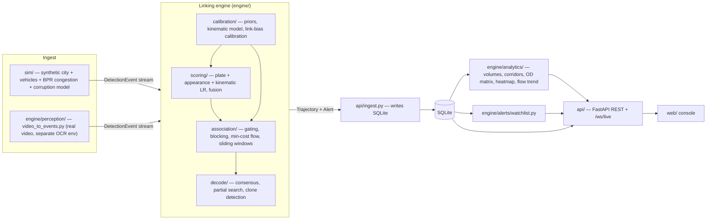

# UrbanTrace — Backend Reference

**At a glance**
- UrbanTrace links noisy per-camera ANPR reads into whole-vehicle trajectories city-wide by fusing three independent evidence channels — plate, appearance, and travel-time likelihood ratios — into one Bayesian score, then solving a global min-cost-flow assignment over all candidate links at once, rather than trusting any single exact-match string.
- Everything downstream (consensus plate decoding, partial-plate search, clone/impossible-travel detection, watchlist matching, analytics) is a direct consequence of having that trajectory-linking machinery, not a bolt-on.
- The system runs as one Python process (`uvicorn api.main:app`) serving REST + a WebSocket over a SQLite database that is populated ahead of time by an ingest step; a separate simulator (`sim/`) generates ground-truthed synthetic camera data, and a separate `engine/perception/` pipeline (its own Python environment, with PyTorch/Ultralytics/fast-plate-ocr) turns real video into the same event contract the engine consumes.
- Every numeric parameter named below (thresholds, window sizes, budgets) is quoted directly from the source file that defines it; every measured number is quoted from `eval/reports/*.json`, `docs/results.md`, or `docs/decisions.md`, or from a command actually run while writing this document.
- 468 tests currently collect under `pytest` (verified: `python -m pytest --collect-only -q`, this checkout).

## Table of contents

1. [Overview](#overview)
2. [Tech stack](#tech-stack)
3. [Contracts](#contracts)
4. [Linking engine](#linking-engine)
5. [Perception pipeline](#perception-pipeline)
6. [Simulator](#simulator)
7. [Datasets](#datasets)
8. [API](#api)
9. [Storage](#storage)
10. [Evaluation harness](#evaluation-harness)
11. [Testing](#testing)
12. [Configuration](#configuration)
13. [Running locally and in Docker](#running-locally-and-in-docker)
14. [Known limitations](#known-limitations)

## Overview

Ingest happens once, offline, ahead of serving: `api/ingest.py` reads a simulated (or video-derived) dataset, links it, decodes consensus plates, detects clones/anomalies, and writes all of it into SQLite. The FastAPI process then only reads that database (plus a small amount of in-memory precomputation at startup) and replays it against a simulated clock for the live demo — it never re-runs the linking engine per request.

## Tech stack

| Component | Library | Why |
|---|---|---|
| Runtime | Python 3.12 | `pyproject.toml` `requires-python = ">=3.12"`. |
| Validation/contracts | Pydantic v2 (`pydantic>=2`) | Typed, validated data contracts (`engine/contracts/*`) shared by every layer. |
| Web framework | FastAPI | REST + WebSocket API (`api/`). |
| ASGI server | Uvicorn | Runs the FastAPI app; the Dockerfile deliberately installs plain `uvicorn` + `websockets` rather than `uvicorn[standard]` — enough for `/ws/live`, without pulling in uvloop/httptools/watchfiles/python-dotenv. |
| WebSocket | `websockets` | Backs `/ws/live`. |
| ORM/storage | SQLAlchemy + SQLite | `api/db.py` — one file-based DB, no separate DB server needed for a demo deployment. |
| Numerics | NumPy | Vectorised scoring (see `engine/scoring/plate_lr.py`'s batched path) and the simulator's math. |
| Graph | NetworkX | Used as the min-cost-flow correctness oracle in tests (`tests/test_mincostflow.py`) — UrbanTrace's own solver is compared against it, not used at runtime for the production solve. |
| Fuzzy matching | rapidfuzz | Candidate blocking only ("never final scoring", per `engine/association/blocking.py`'s own docstring) and clone-candidate grouping by decoded-plate edit distance (`engine/decode/clone_detect.py`). |
| Config parsing | PyYAML | Reads `plate_config.yaml` for the fast-plate-ocr adapter (`engine/perception/fpo_adapter.py`). |
| CLI | Typer | `sim/generate.py`, `api/ingest.py`, `eval/*` entry points. |
| CLI output | Rich | Console formatting for the same CLI tools. |
| Eval extras | SciPy, scikit-learn | `scipy` is used in `eval/`/referenced in `engine/association/gating.py`'s comments; scikit-learn backs `engine/calibration/calibrate.py`'s isotonic regression. Neither is imported by the runtime API/sim/ingest path, so both live in the `eval` extra, not the base dependency set (`pyproject.toml`'s own comment). |
| Dev/test extras | pytest, ruff, httpx, Pillow, opencv-python-headless | `httpx` backs FastAPI's `TestClient`; Pillow/opencv-python-headless are needed only by `tests/test_synth_plate_safety.py`, which renders plate images from the main venv (deliberately CPU-only, no torch) per the reviewer's requirement that this specific test not depend on the separate OCR environment. |
| Perception/OCR environment (separate from the above, not installed in the API runtime) | PyTorch, Ultralytics YOLO, fast-plate-ocr, ONNX Runtime, OpenCV (`cv2`), Pillow | Verified by grepping imports in `engine/perception/*.py`: `torch` (`crnn.py`, `eval_ocr.py`, `train_ocr.py`, `video_to_events.py`), `from ultralytics import YOLO` (`detect.py`, `finetune_detector.py`), `fast_plate_ocr`/`onnxruntime` (`eval_fpo.py`, `train_fpo.py`, `video_to_events.py`, kept out of `fpo_adapter.py`'s own top-level imports by design so that module stays testable from the main venv), `cv2` (`synth_plates.py`, and lazily inside `video_to_events.py`), `PIL.Image` (`build_real_set.py`, `eval_detector.py`, `synth_plates.py`, `train_ocr.py`, `video_to_events.py`). None of these are installed in the Docker runtime image. |

## Contracts

Defined in `engine/contracts/` (Pydantic models). These are the fixed interfaces between layers — "the hard contract between ingest (L1) and the linking engine (L3)" per `engine/contracts/events.py`'s own docstring.

- **`DetectionEvent`** (`events.py`) — one camera read: `event_id`, `camera_id`, `timestamp`, `plate_posterior` (a list of exactly 10 `SlotPosterior`s — always present, never omitted even when unread), `plate_argmax` (derived convenience string), `plate_confidence`, `embedding` (128-d, L2-normalised, validated by a Pydantic field validator), `attributes` (`VehicleAttributes`: color, vehicle_type, and their own confidences), `crop_uri`, `source` (`"sim" | "video" | "csv"`), `gt_vehicle_id` (simulator-only, for evaluation), and `embedding_ref` (row index into a companion `embeddings.npy` when loaded via `EventStore`). The engine consumes `DetectionEvent`s "and neither knows nor cares" where they came from.
- **`SlotPosterior`** / plate contracts (`plate.py`) — the per-character-slot probability distribution; `PLATE_SLOTS` defines the fixed 10-slot canonical layout (state, RTO, series, number) and `BLANK` is the padding symbol for a slot that is legitimately empty (e.g. a 1-letter series).
- **`Trajectory`** (`trajectory.py`) — a linked sequence of event ids plus per-link `LinkEvidence` (the `plate_lr`/`appearance_lr`/`kinematic_lr`/`prior_log_odds`/`total_log_odds`/`delta_t_s`/`expected_t_s`/`skipped_cameras` breakdown that the frontend's WHY panel renders).
- **`CityConfig`** (`city.py`) — road graph (`RoadNode`, `RoadEdge`) and `Camera` list.
- **`codec.py`** — the compact on-disk encoding for a `SlotPosterior` (see [Datasets](#datasets)) and `store.py`'s `EventStore` reader/writer pairing a JSONL file with a companion float16 `embeddings.npy`.

## Linking engine

### Scoring (`engine/scoring/`)

Three independent likelihood-ratio (LR) channels are computed per candidate event pair, then summed in log-odds space with a prior:

- **Plate LR** (`plate_lr.py`). `log LR = log[Σ_y π(y)P(A|y)P(B|y)] − log[(Σ_y π(y)P(A|y))·(Σ_y π(y)P(B|y))]`, factorised into groups rather than 10 independent slots: state code (slots 0–1) and RTO code (slots 2–3) are each a joint unit with a real, non-uniform prior (`PlatePriors.state_matrix` 26×26, `rto_matrix` 10×10); series/number slots (4–9) are independent with a flat prior. Every probability is floored at `FLOOR = 1e-9` before use, so no finite input can produce `-inf`. The scorer searches five plausible slot-alignment shifts (`_ALIGNMENTS`: `none`, `series±1`, `number±1`) to handle an OCR misread that drops/inserts a character right at a segment boundary, and keeps the max-likelihood alignment. A batched NumPy path (`precompute_plate_batch_arrays` / `score_plate_pairs_batch`) precomputes per-event work once and processes pairs in chunks of `PAIR_CHUNK_SIZE = 200_000` to bound memory.
- **Appearance LR** (`appearance_lr.py`). Two parts summed: (1) a density-ratio LR on cosine distance between two events' 128-d Re-ID embeddings, using fitted smoothed histograms `p1(d)` (same-vehicle) vs `p0(d)` (different-vehicle) rather than a hand-tuned threshold; (2) a discrete color/vehicle-type term using confusion matrices, marginalised over the unknown true color/type the same way the plate channel marginalises over the unknown true plate. Constants: `FLOOR = 1e-9`, `CLAMP = 20.0` (the total is clamped to `[-CLAMP, CLAMP]` so this channel alone can never dominate fusion), `N_BINS = 40` histogram bins over cosine distance range `[0.0, 2.0]`, `HIST_SMOOTHING = 1.0`, `CATEGORICAL_SMOOTHING = 1.0`.
- **Kinematic (travel-time) LR** (`kinematic_lr.py`). `DEFAULT_V_MAX_KMH = 120.0` (the hard physical speed ceiling used both here and by clone detection), `KINEMATIC_LR_CLAMP = 20.0`. Fits a log-normal travel-time distribution per `(camera_i, camera_j, time-of-day bucket)`.
- **Fusion** (`fusion.py`) — combines `prior_log_odds + plate_lr + appearance_lr + kinematic_lr` into `total_log_odds`; `FusionModel` is built from `plate_priors`, `kinematic_model`, and `appearance_model` together (see `api/ingest.py::build_demo_trajectories`).

### Association (`engine/association/`)

- **Gating** (`gating.py`) — the primary and, per its own docstring, "sufficient" blocker: "if a true predecessor is dropped here, nothing downstream can ever recover it." For every event `j`, a candidate predecessor `i` must satisfy `t_i < t_j`, road-graph reachability, and a per-`(camera_i, camera_j, time-of-day)` travel-time window. Key constants: `GATE_Z_SCORE = 3.0` (window half-width in fitted log-normal standard deviations, chosen by sweeping to keep true-predecessor recall above 99% — the requirement enforced by `tests/test_gating.py`), `DEFAULT_MISS_WIDEN_FACTOR = 1.3` (extra widening when the shortest path skips an intermediate camera), `MIN_DT_FLOOR_S = 0.0`, and `CONGESTION_TAIL_FACTOR = 4.0` — a hard multiplicative floor on the window's upper bound, expressed as a multiple of free-flow travel time, so a legitimately congested true predecessor (measured up to ~4.3× free-flow time at peak load under the simulator's BPR congestion) is never excluded by the fitted distribution's own (much narrower) spread.
- **Blocking** (`blocking.py`) — a secondary, *overflow-only* valve, explicitly not the production default path ("window.py scores every gated candidate"): when gating leaves more than `DEFAULT_CANDIDATE_BUDGET = 4000` candidates for one event, a rapidfuzz `Levenshtein`-distance ranking keeps only the closest `budget` of them (`DEFAULT_MAX_EDIT_DISTANCE = 3`, `DELETION_INDEX_THRESHOLD = 4000` decides whether a deletion-neighbourhood index or an exhaustive scan is used).
- **Min-cost flow** (`mincostflow.py`) — global association solved as min-cost flow over a time-ordered DAG: one node per event split into an entry/exit pair, `source→entry` and `exit→sink` costs learned from the fraction of events at border vs. interior cameras (`fit_entry_exit_costs`), and a link arc `i→j` costed at `-s(i,j) + exit_cost(i) + entry_cost(j)` (documented as a deliberate post-fix formula: charging the link arc the *same* two costs it replaces makes the solver prefer linking over the bypass if and only if `s(i,j) > 0`, the honest Bayesian posterior-odds threshold — the earlier bare `-s(i,j)` formula silently under-charged linking and was responsible for 57.6% of one measured over-merging run's wrong links, per `eval/reports/error_analysis.json`). Solved by a from-scratch successive-shortest-augmenting-paths implementation with Johnson potentials (float costs, not OR-Tools' integer-only solver), stopping the instant the shortest augmenting path's cost turns non-negative, so the optimal vehicle count falls out of one pass. `networkx.min_cost_flow` is used only as a correctness oracle in `tests/test_mincostflow.py`.
- **Sliding windows** (`window.py`) — `DEFAULT_WINDOW_SIZE_S = 1800.0` (30 minutes), `DEFAULT_WINDOW_STEP_S = 900.0` (15 minutes, i.e. 50% overlap between consecutive windows). Also exposes a `link_bias` parameter (β, in nats, default 0.0): the arc cost becomes `-s(i,j) + exit_cost(i) + entry_cost(j) - β`, so a positive β makes linking easier (recovers true links whose honest score is mildly negative under heavy congestion) without touching pruning, which stays exactly `s(i,j) ≤ -β` at any β.

### Decode (`engine/decode/`)

- **Consensus** (`consensus.py`) — fuses every event on a trajectory into one plate: `P(y|T) ∝ π(y)·Π_m P(O_m|y)`, using the same group factorisation as `plate_lr.py` (so decoded plate = concatenation of each group's own argmax, confidence = product of each group's own argmax mass, entropy = sum of each group's own entropy). Uses an epsilon-contamination robust likelihood (each read modelled as coming from the OCR channel with probability `1-EPS` or an unmodelled outlier process otherwise) so one bad read cannot veto an otherwise-clear majority; computed in log-space with running-max normalisation to avoid underflow across many events. Constant: `FLOOR = 1e-9`.
- **Partial search** (`partial_search.py`) — scores a `?`-wildcard 10-slot query against a trajectory's fused posterior: the probability the true plate matches a fully specified query is the product, over every pinned slot, of that slot's fused marginal probability for the pinned character (a `?` slot contributes 1.0). Documented as an approximation when a query pins only one slot of the joint state/RTO pair, since `Consensus.per_slot` only exposes marginals, not the joint table — "good enough for ranking search candidates; documented, not hidden."
- **Clone detection** (`clone_detect.py`) — pairwise, for trajectories sharing an (near-)identical decoded plate (grouped via rapidfuzz edit distance, blocking only): (1) physical feasibility — every adjacent cross-trajectory event pair is checked against the *same* hard-gate arithmetic as the kinematic LR's `v_max` (`DEFAULT_V_MAX_KMH = 120.0`), deliberately reused rather than re-derived; (2) appearance divergence — cosine distance between the two trajectories' mean re-normalised embeddings above `APPEARANCE_DIVERGENCE_THRESHOLD = 0.5` (chosen well above same-vehicle repeat-embedding noise and well below distinct appearance-class separation). `Alert` and `PathPoint` are defined in this module (not `engine/contracts`) and reused by `engine/analytics/anomalies.py` for its own non-clone alerts.

### Calibration (`engine/calibration/`)

- **`fit_priors.py`** — fits `PlatePriors`, the `KinematicModel`, and the `AppearanceModel` from a training dataset generated on the *same* city graph as the target dataset (a different vehicle-population seed) — a kinematic model is only meaningful evaluated against the camera network it was fit on.
- **`calibrate.py`** — isotonic-regression probability calibration (scikit-learn), fit on TRAIN pairs and evaluated on HELD-OUT pairs (never fit-and-scored on the same pairs, since isotonic regression is flexible enough to fit its own training labels almost perfectly and would otherwise read as artificially well-calibrated). Eval-only, not imported by the runtime API/sim/ingest path.
- **Link-bias calibration** (`eval/calibrate_link_bias.py`, not `engine/calibration/`) — the β used in `window.py` is calibrated on a separate full-city-density training day rather than the day it is applied to (avoiding tuning on the test set); `docs/results.md` records β = 5 for the shipped result.

### Analytics (`engine/analytics/`)

| Module | Computes |
|---|---|
| `volumes.py` | Per-camera event counts bucketed by time; `DEFAULT_BUCKET_MINUTES = 60`. |
| `corridors.py` | Travel times/speeds for every consecutive-camera pair that actually occurs back-to-back in a trajectory, against road-graph free-flow time. |
| `od_matrix.py` | Origin-destination matrix over 5 zones (`N, S, E, W, Central`), assigned per-camera from lat/lon relative to the dataset's own camera centroid (no real-world geocoding — the city is synthetic). |
| `heatmap.py` | `density` = reads per camera in a window, normalised to `[0, 1]` by the window's busiest camera; `speed` = mean km/h of trajectory links arriving at a camera in the window, using the same road-graph-distance / `v_max`-exclusion approach as `corridors.py`. |
| `flow_trend.py` | City-wide bucketed reads, active-trajectory counts, and mean link speed; buckets anchored to the earliest event, not wall-clock midnight, mirroring `volumes.py`. |
| `direction.py` | Standard forward-azimuth bearing (0 = north, clockwise) for `heading_deg`/`overall_heading_deg`/`direction_label`. |
| `anomalies.py` | Loop anomalies: a trajectory revisiting the same camera ≥ 3 times within any rolling one-hour window. |

### Watchlist (`engine/alerts/watchlist.py`)

Probabilistic plate matching against blacklisted patterns (`MATCH_THRESHOLD = 0.5`). Reuses `decode_trajectory` for the *growing trajectory consensus* check and `partial_search.match_probability`/`normalise_query` for both checks. Single reads are deliberately **not** run through `decode_trajectory`: its epsilon-contamination mixing caps any single read's confidence (at `EPS=0.2`, a maximally confident single read tops out around P≈0.19 for a fully-pinned query — below `MATCH_THRESHOLD` no matter how certain the read actually was), so single reads instead score directly off the read's own reconstructed per-slot posterior. The module also deliberately does not reuse the DB's precomputed final `TrajectoryRow.consensus` (that blob is computed over *all* of a trajectory's events at ingest time; live replay needs the consensus recomputed on only the events revealed so far).

## Perception pipeline

`engine/perception/` turns real dashcam/CCTV-style video into the same `DetectionEvent` contract the engine consumes, so the linking engine is agnostic to whether an event came from the simulator or real video.

| Module | Role | Environment |
|---|---|---|
| `synth_plates.py` | Renders synthetic Indian plate images (grammar-correct, HSRP blue strip + chakra hologram, perspective/rotation/crop jitter) for OCR pre-training. Uses `cv2`, `PIL`. | Main venv (CPU-only; its safety property is exercised by `tests/test_synth_plate_safety.py` from the main venv per the dev-extras comment in `pyproject.toml`). |
| `crnn.py`, `train_ocr.py`, `eval_ocr.py` | The project's own CRNN OCR baseline: training and evaluation. Import `torch`. | Separate OCR venv. |
| `ctc_to_slots.py` | Converts CTC decodes into the 10-slot posterior shape the engine contract expects. | Main venv (numpy only). |
| `fpo_adapter.py` | Adapts `fast-plate-ocr`'s per-position output distribution into the 10-slot posterior with grammar alignment, deliberately with **no** `fast_plate_ocr`/`onnxruntime` import at module top level, so it stays importable/testable from the main venv. | Main venv (adapter logic); actual inference needs the OCR venv. |
| `train_fpo.py`, `eval_fpo.py` | Fine-tunes/evaluates `fast-plate-ocr` (needs `fast_plate_ocr`, Keras, albumentations, onnxruntime for export). | Separate OCR venv. |
| `detect.py`, `finetune_detector.py`, `eval_detector.py` | Plate detector: Ultralytics YOLO inference and fine-tuning. | Separate OCR venv (imports `ultralytics`). |
| `build_real_set.py` | Builds the real-plate train/val/test split from labelled crops. | Main venv (`numpy`, `PIL`). |
| `video_to_events.py` | End-to-end: video → detection → OCR → `DetectionEvent`s, in the same contract the simulator emits. Reads both `fast_plate_ocr` and `onnxruntime` (imported lazily inside functions, not at module top level, to keep the module's own top-level imports environment-light) and `torch`. | Separate OCR venv. |

## Simulator

`sim/` generates a synthetic city, a vehicle population, and a corrupted `DetectionEvent` stream with ground truth, so trajectory-linking accuracy can be measured honestly.

- **City** (`city.py`) — a grid of local streets, a handful of arterial roads and skip-chords, and an outer ring road; deterministic given a seed; centred near Nagpur (`CITY_CENTER_LAT = 21.1458`, `CITY_CENTER_LON = 79.0882`) as an "arbitrary but plausible anchor."
- **Vehicles/routes** (`vehicles.py`) — each vehicle gets a true 10-slot plate, a color/type, and a 128-d appearance embedding drawn from a three-level hierarchical mixture (type/color class → model archetype → per-instance quirk), mirroring real Re-ID structure where many vehicles share a body color and type, fewer share a specific silhouette, and individual vehicles still differ by wear/stickers/damage. Journeys pick a random border-camera origin/destination pair and route via a mildly randomised shortest path, honoring a time-of-day demand profile with rush-hour peaks.
- **Congestion** (`congestion.py`) — the standard BPR (Bureau of Public Roads) link-performance function `t_edge = t_free · (1 + α·(v/c)^β)`, `v` the hourly volume entering an edge, `c` its capacity by road class; `docs/architecture.md` records the shipped parameters as α = 0.15, β = 4. Computed in two passes (free-flow routing to collect per-edge volumes, then a single recomputation of travel times against those volumes) rather than an iterative loop to convergence, since routes are chosen once and never re-optimized against congested times.
- **Corruption** (`corruption.py`) — turns ground-truth passages into noisy `DetectionEvent`s: OCR corruption emits a genuine per-slot posterior (most mass on the sampled character, remainder leaked to a visually-confusable group, e.g. `{O, 0, D, Q}`), never a bare sampled character. Per `docs/decisions.md`, this model is deliberately pinned to published real-world figures rather than tuned to flatter the method (an "anti-strawman guard"): whole-plate OCR accuracy at full production scale measured 0.8808 (inside the cited 85–95% published-figure band), and appearance-only rank-1 retrieval calibration lands in the 65–75% band at benchmark (VeRi-776) scale (`tests/test_calibration.py`).

## Datasets

- **Simulated runs**: the headline evaluation day `run2` (50 cameras, 19,996 vehicles, 24 h, rush-hour BPR congestion, seed 43, 103,475 reads) and the earlier uncongested day `data/run1` (107,234 reads), both referenced throughout `docs/decisions.md`/`docs/results.md`; the link threshold and priors are fitted on separate training days with other seeds. Test fixtures: `data/tiny_test` and `data/tune_consensus` fixtures. The Makefile's default demo scale is 25 cameras / 4,000 vehicles / 6 hours (`make sim`); the documented target scale (`docs/architecture.md` §8) is 50 cameras / 20,000 vehicles / 24 simulated hours, measured at ~103,000 reads/day.
- **Real Indian plate OCR data**: per `docs/decisions.md`, the real OCR set is 1,587 crops / 904 unique plates from the team's `indian_vehicle_xml`, split by plate string with zero plate overlap between splits (train 929 images / 546 plates, val 148/82, test 510 images / 276 plates); 110 labels were excluded (108 fail the plate grammar). Sourced from three labelled origins named in the results: video frames, OLX listings ("State-wise_OLX"), and Google Images.
- **Detector data**: fine-tuned on Indian scene images, holding out a whole video's frames (near-duplicate frames of the same video are never split across train/holdout) and never touching the OCR val/test images.
- **Where data lives**: `engine/paths.py`'s `get_data_dir()` resolves to `$URBANTRACE_DATA_DIR` if set, else `<repo_root>/data` — a gitignored directory outside version control.
- **Not redistributed**: the real plate/detector image sets are not committed to the repository (they live under the configurable data directory); `eval/reports/*.json` (the derived metrics) *are* tracked in git — each under 3 KB and treated as defence evidence, per `docs/decisions.md`'s explicit note that per-file gitignore exceptions were preferred over risking a report being silently lost.

## API

All routers are mounted under `/api` (or `/api/watchlist`, `/api/analytics`) by `api/main.py`; see `docs/api-contract.md` for the frozen wire contract this section cross-checks against.

| Router (`api/routers/*.py`) | Method + path | Purpose |
|---|---|---|
| `core.py` | `GET /api/health` | Dataset name, event/trajectory counts. |
| | `GET /api/city` | Road graph (nodes, edges) + camera list. |
| | `GET /api/cameras` | Per-camera stats (`events_total`, `volume_last_hour`, precomputed in `api/state.py`). |
| | `GET /api/events`, `GET /api/events/{event_id}` | Paginated event list / single event detail (full per-slot posterior). |
| | `GET /api/trajectories`, `GET /api/trajectories/{trajectory_id}` | Paginated trajectory list (filterable by time, plate, camera, min length, has-alert) / full detail (events, links, path, consensus). |
| | `GET /api/search` | Partial-plate search: parses the query via `api/plate_grammar.py::enumerate_canonical_forms`, scores every canonical form against every trajectory's consensus via `engine.decode.partial_search.match_probability`, returns the best-per-trajectory hits ranked by probability. |
| `analytics.py` | `GET /api/analytics/summary` | Precomputed dataset-wide KPIs from `AppState` (built once at startup). |
| | `GET /api/analytics/volumes` | `compute_volumes` over cached lite-events, bucketed on the fly per request. |
| | `GET /api/analytics/od_matrix` | Precomputed OD matrix. |
| | `GET /api/analytics/corridors` | Precomputed corridor stats, sliced by `limit`. |
| | `GET /api/analytics/heatmap` | Density or speed heatmap; `at` defaults to the current replay sim time if running, else the dataset's end. |
| | `GET /api/analytics/flow_trend` | Bucketed reads/active-trajectories/mean speed. |
| `alerts.py` | `GET /api/alerts` | Alerts, filterable by `type`, newest first. |
| `watchlist.py` | `GET /api/watchlist`, `POST /api/watchlist`, `DELETE /api/watchlist/{entry_id}`, `GET /api/watchlist/hits` | CRUD for watchlist entries (pattern expanded to canonical forms at creation time via `enumerate_canonical_forms`) and a read-only feed of recorded probabilistic hits. Matching itself happens live during replay (`api/replay.py`), not in this router. |
| `eval.py` | `GET /api/eval` | Raw contents of every `eval/reports/*.json`, keyed by file stem; tolerates a missing reports directory. |
| `replay.py` | `POST /api/replay` | `{action: start\|pause\|reset, speed?}` — mutates the shared simulation clock (`ReplayEngine`). |
| `ws.py` | `WS /ws/live` | Server-push only: streams `event`, `trajectory`, `alert`, and `clock` messages as the replay clock advances. The route drains (but ignores) anything the client sends, purely so `receive` doesn't error. |

**Replay engine** (`api/replay.py`): one shared clock for every connected client (not per-connection). `DEFAULT_SPEED = 60.0`, `DEFAULT_TICK_INTERVAL_S = 0.5`, `CLOCK_EMIT_INTERVAL_S = 1.0`. It does not re-run the linking solver live — the module's own docstring calls this "honest framing": association is already computed once at ingest time by `engine.association.window.solve_windowed` (which is itself online-capable), and replay just streams that already-linked dataset against a simulated clock so a demo can show "the city as it happened" at any speed. New clients connecting mid-replay get no backfill (`GET /api/trajectories` etc. cover backfill); this is a live tail only.

## Storage

SQLite via SQLAlchemy (`api/db.py`). Every table and its key columns:

| Table | Key columns |
|---|---|
| `cameras` | `camera_id` (PK), `name`, `lat`, `lon`, `node_id`, `bearing_deg`, `is_border`. |
| `events` | `event_id` (PK), `camera_id`, `timestamp`, `plate_argmax`, `plate_confidence`, `color`, `vehicle_type`, `trajectory_id` (nullable), `posterior` (JSON: top-5 chars per slot + `unread` flag), `embedding_ref`. Indexed on `camera_id`, `timestamp`, `trajectory_id`, `plate_argmax`. |
| `trajectories` | `trajectory_id` (PK), `decoded_plate`, `plate_confidence`, `start_time`, `end_time`, `n_events`, `camera_sequence` (JSON), `color`, `vehicle_type`, `has_alert`, `event_ids` (JSON), `consensus` (JSON — the **full** per-slot posterior, not just top-5, because `partial_search` needs the whole distribution to score arbitrary queried characters), `links` (JSON list of `LinkEvidence`-shaped dicts, non-finite floats already converted to `None`), `path` (JSON list of `PathPoint`-shaped dicts). Indexed on `decoded_plate`, `start_time`, `end_time`. |
| `alerts` | `alert_id` (PK), `type`, `severity`, `created_at`, `plate`, `trajectory_ids` (JSON), `summary`, `evidence` (JSON). Indexed on `type`, `created_at`. |
| `watchlist_entries` | `entry_id` (PK), `pattern`, `canonical_patterns` (JSON, precomputed at creation time so matching never re-parses `pattern` live), `reason`, `created_at`, `active`, `hits`. |
| `watchlist_hits` | `hit_id` (PK), `entry_id`, `pattern`, `event_id`, `trajectory_id` (nullable), `camera_id`, `timestamp`, `probability`, `matched_on`, `plate_read`. Written on every match ≥ `MATCH_THRESHOLD`; the first hit for a given `(entry_id, trajectory_id)` pair also creates an `alerts` row with `type="watchlist"`. Indexed on `entry_id`, `timestamp`. |
| `meta` | `key` (PK) → `value` (JSON) — dataset-level facts computed once at ingest: `dataset_name`, `plate_repair_rate`, and the full serialized `city` graph. |

**Design rationale** (from `api/db.py`'s own docstring): events/trajectories carry both queryable scalar columns (for SQL filtering/pagination) *and* the richer nested shapes (posterior, consensus, links, path) as JSON columns, so the API layer never has to re-run engine computation (consensus decoding, clone detection, …) at request time — only once, at ingest time.

**Ingest** (`api/ingest.py`, `python -m api.ingest`): reads a dataset directory's `city.json`/`events.jsonl`/`embeddings.npy`, fits priors on a *separate* training-split dataset generated on the same city (`DEFAULT_TRAIN_VEHICLES = 8000`, `DEFAULT_TRAIN_SEED_OFFSET = 9001`), then links events either from `--trajectories <pipeline output>.jsonl` (mode `"pipeline"`) or, with `--build-demo`, by running `engine.association.window.solve_windowed` in-process (mode `"build-demo"`, "makes the API usable before, or independently of, a full `eval/run_pipeline.py` run"). Every ingest run first deletes all rows from `events`, `trajectories`, `alerts`, `cameras`, `meta`, and `watchlist_hits` (hits reference event/trajectory ids that are about to be replaced) — but **not** `watchlist_entries`, so an operator's watchlist survives re-ingest.

**`URBANTRACE_DB_PATH`** must point outside a synced folder such as OneDrive: `docs/decisions.md` records a measured 335 s ingest locally versus over 3 hours (209 CPU-seconds of actual work) when the same ingest ran against a database inside an actively-syncing OneDrive folder, because every SQLite write triggers a re-sync of the whole (600 MB in that measurement) database file. The Makefile/`make.ps1` both default `URBANTRACE_DB_PATH` to a location outside the project folder for this reason, and `docker-compose.yml` uses a named Docker volume rather than a bind mount into the project directory for the same reason.

## Evaluation harness

`eval/*.py` scripts write to `eval/reports/*.json`, which `GET /api/eval` serves verbatim:

| Script | Report(s) | Measures |
|---|---|---|
| `run_pipeline.py` | `trajectory_metrics*.json` | End-to-end linking accuracy (IDF1, ID switches, predicted vs. true trajectory counts) for a given dataset/config, including labelled historical variants (`_run1`, `_beta0`, `_pre_kinfix`, `_prefix`) kept for before/after comparison. |
| `baselines.py` | `baselines.json` | Simpler baseline linking strategies (exact-match, fuzzy, fuzzy + hard travel-time window) scored the same way, for comparison against the full engine. |
| `stratified.py` | `stratified_auc.json` | Per-channel/fused AUC split into four named strata (routine, clone, degraded, plate-similar) rather than one aggregate number. |
| `stratified_auc_report.py` | (drives `stratified.py`'s report generation) | — |
| `clone_overlap_report.py` | `clone_overlap_auc.json` | Clone-detection separability when clone routes overlap with their source vehicle's route (the harder case than disjoint routes). |
| `consensus_report.py` | `consensus_accuracy.json` | Plate-repair accuracy from fusing multiple noisy reads into one consensus plate. |
| `error_analysis.py` | `error_analysis.json` | Diagnoses wrong links (e.g. the 57.6%-of-wrong-links-had-negative-log-odds finding that motivated the min-cost-flow arc-cost fix). |
| `gating_report.py`, `gate_recall_by_hour.py` | `gating.json`, `gate_recall_by_hour*.json` | Candidate-gate recall and mean candidates/event, overall and broken down by hour (surfacing the congestion-hour recall hole documented in `docs/decisions.md`). |
| `blocking_report.py` | `blocking.json` | How often the secondary blocking overflow valve actually engages, and its recall cost when it does. |
| `calibrate_link_bias.py` | `link_bias_calibration*.json` | Sweeps the link-decision bias β on a held-out training day. |
| `ablation.py` | `ablation.json` | Per-channel ablation (linking accuracy with each evidence channel removed). |
| `appearance_scaling_report.py` | `appearance_scaling.json` | Appearance-only rank-1 retrieval as gallery size scales from benchmark to city scale. |
| `stress.py` | `stress_sweep.json` | Accuracy across a sweep of injected OCR error rates (0→40%). |
| `metrics.py` | (shared library, no direct report) | `appearance_rank1`, `sample_labeled_pairs`, and other metric primitives used by the scripts above. |
| — (perception-side, written by `engine/perception/eval_*.py`) | `ocr_real*.json`, `ocr_synthetic.json`, `detector_eval.json`, `detector_holdout_video.json` | Real/synthetic OCR accuracy (whole-plate, per-character, per-unique-plate, ECE) and detector precision/recall/mAP, including the fine-tuned-vs-pretrained and video-holdout comparisons the Results page's OCR progression renders. |

Per `docs/results.md`: "nothing is tuned on what it is scored on" — priors, the link threshold, and the congestion model are calibrated on separate simulated days with different random seeds, and OCR is scored once on real plates held out by plate string.

## Testing

**468 tests** collected (`python -m pytest --collect-only -q`, this checkout, 3.10s collection time). Notable exactness/regression tests, by name and file:

- `tests/test_gating.py` — asserts candidate-gate true-predecessor recall exceeds 99% (the load-bearing recall requirement the whole downstream pipeline depends on).
- `tests/test_mincostflow.py` — the from-scratch min-cost-flow solver's cumulative cost after k* augmentations must exactly match `networkx.min_cost_flow`'s optimum for exactly k* units (the classical successive-shortest-paths invariant), on small random instances.
- `tests/test_batch_scoring.py`, `tests/test_chunked_batch_scoring.py` — the vectorised/chunked plate-scoring path must agree with the scalar path to floating-point precision.
- `tests/test_zero_probability_guard.py::test_true_character_never_has_zero_probability_in_a_read_slot` — a permanent regression guard verified at full production scale (50 cameras/20k vehicles/24h): 0 zero-probability slots out of 1,062,981 read slots.
- `tests/test_storage.py` — asserts the on-disk compact codec's bytes/event target and exact round-trip fidelity (posteriors within 1e-3, embeddings within float16 precision after renormalisation).
- `tests/test_determinism.py` — a given seed must reproduce byte-identical simulator output.
- `tests/test_ground_truth_integrity.py` — the simulator's own ground truth must be internally consistent (used to validate metrics computed against it).
- `tests/test_calibration.py` — splits appearance rank-1 calibration into a benchmark-scale test (1,500 vehicles, expects 65–75% rank-1) and a city-scale non-collapse floor test (20,000 vehicles, expects ≥ 35% rank-1).
- `tests/test_stratified_auc.py::test_clone_stratum_plate_only_collapses_to_chance_but_fusion_holds` — hard-asserts plate-only AUC < 0.60 and fused AUC > 0.90 on the clone stratum; described in `docs/decisions.md` as "the project's thesis encoded as a test, not a number to be re-tuned if it fails."
- `tests/test_window.py::test_link_bias_shifts_the_link_threshold`, `::test_windowed_solve_covers_every_event` — sliding-window solver correctness, including the link-bias β mechanism.
- `tests/test_synth_plate_safety.py` — verifies the plate renderer's character-containment guarantee (every labelled character is actually visible in the rendered image), runnable from the main venv without torch by design.

## Configuration

Environment variables (grepped across `api/`, `engine/`, `sim/`, `eval/`):

| Variable | Default if unset | Used by |
|---|---|---|
| `URBANTRACE_DATA_DIR` | `<repo_root>/data` | `engine/paths.py::get_data_dir()` — base directory for datasets. |
| `URBANTRACE_DB_PATH` | falls back to `SUTRA_DB_PATH`, then `<data_dir>/urbantrace.db` | `engine/paths.py::get_db_path()` — SQLite file location. |
| `SUTRA_DB_PATH` | — | Legacy alias for `URBANTRACE_DB_PATH`, kept for backward compatibility. |

## Running locally and in Docker

**Makefile / `make.ps1` targets** (identical target names; Windows teammates use `make.ps1`):

| Target | Does |
|---|---|
| `setup` | Creates `.venv`, installs the package with `[dev]` extras, runs `npm install` in `web/`. |
| `test` | `pytest`. |
| `lint` | `ruff check .` then `npm run lint` in `web/`. |
| `sim` | `python -m sim.generate` — demo defaults `CAMERAS=25 VEHICLES=4000 HOURS=6 SEED=42`; the full target-scale run is `CAMERAS=50 VEHICLES=20000 HOURS=24`. |
| `pipeline` | `python -m eval.run_pipeline --data data/run1 --out data/run1/pipeline`. |
| `ingest` | `python -m api.ingest --data data/run1 --trajectories data/run1/pipeline/trajectories.jsonl --db $(DB)`. |
| `serve` | `python -m uvicorn api.main:app --port 8000`. |
| `docker-up` | `docker compose up --build urbantrace`. |
| `docker-seed` | `docker compose --profile seed run --rm seed` — generates a small (25 cam/4,000 vehicle/6h) dataset and ingests it with `--build-demo`, so a fresh machine gets a working demo in a few minutes; run once before `docker-up`, or restart the `urbantrace` service afterward since it loads its DB snapshot once at startup. |

**Docker** (`Dockerfile`, multi-stage): stage 1 (`node:22-slim`) builds the web console with `VITE_USE_MOCK=false` baked in; stage 2 (`python:3.12-slim`) installs only the runtime dependency set listed in the tech-stack table above (explicitly not `scipy`/`scikit-learn`/`httpx`, which are eval-/test-only and never imported by `uvicorn api.main:app`, `sim.generate`, or `api.ingest`), strips bundled test suites and `__pycache__` from site-packages in the same layer as the install, copies `engine/`, `api/`, `sim/`, and only `eval/reports/` (not the `eval/` Python package itself — verified by grep, since `api/routers/eval.py` reads the JSON files directly rather than importing anything from `eval/`) as plain source, copies the built `web/dist` from stage 1, and runs as a non-root `urbantrace` user with `URBANTRACE_DB_PATH=/data/urbantrace.db` pointing at a mounted volume. Per `docs/decisions.md` and `docs/memory.md`: **the image was verified end to end at 329 MB** (build, seed, serve; health, UI, trajectories, and eval endpoints checked), using runtime dependencies only — no PyTorch or evaluation extras. `docker-compose.yml` defines the `urbantrace` service (port 8000, named volume `urbantrace-db`, never a bind mount into the project folder) and a one-shot `seed` profile that generates and ingests the small demo dataset.

## Known limitations

Stated in the project's own docs, not invented here:

- **Real-plate whole-plate OCR does not meet the PRD's >90% target.** Final reported result (`docs/results.md`/`docs/decisions.md`, fast-plate-ocr `cct-s-v2-global` fine-tuned 60 epochs on the real train split, scored once on the held-out real test split of 510 images / 276 plates): whole-plate accuracy 81.0%, per-character accuracy 94.3%, per-unique-plate accuracy 77.2%, calibration ECE 0.041. The PRD's >90% target is **met at the per-character level, not at the whole-plate level** — stated as such in the results, not claimed otherwise. The project's own from-scratch CRNN peaked at 44.3% whole-plate and is documented as having "hit the data wall" (too few unique real training plates, 546, for the model to generalize past memorization).
- **Appearance-only retrieval does not scale to city density on its own.** Rank-1 retrieval lands in the calibrated 65–75% band at benchmark (VeRi-776-like) gallery scale but only ~43–44% at full 20,000-vehicle city scale (`docs/decisions.md`) — documented as expected behavior illustrating the project's own thesis (appearance alone is insufficient at scale and must be fused with plate + kinematic evidence), not a defect being hidden.
- **The detector's real weakness is small plates in multi-lane frames** (the PRD's own stated scenario): plates around 30px in 1920×1080 highway frames shrink to ~10px at the default 640px inference input. On a held-out video (50 frames, 35 plates), fine-tuned detector recall is 0.506, mAP50 0.530 at imgsz 640 — an improvement over the pretrained baseline (0.333 recall) but still limited, and not re-checked on close-up photos after fine-tuning (flagged as an open gap in `docs/decisions.md`).
- **A hard kinematic (travel-time) fix that improved a small ablation city's IDF1 did not transfer to full-city density** (0.981→0.992 small ablation, but 0.9899→0.9891 full-city with more ID switches), and was kept anyway with the link-decision threshold calibrated separately instead of reverting to a known-mis-specified model — documented in `docs/decisions.md` as a deliberate choice to avoid tuning on the test set.
- **Partial-plate search requires a fixed 10-slot-aligned query.** `engine/decode/partial_search.py`'s own docstring states this is a known limitation, not an oversight: a shorter, human-typed plate is genuinely ambiguous about how many series letters vs. number digits it has, and the module deliberately does not guess the split — callers must align a variable-length query to 10 slots themselves. The API does exactly that: `api/plate_grammar.py::enumerate_canonical_forms` expands a typed pattern into every grammatical 10-slot layout before scoring, so operators can type plates naturally.
- **Blocking (`engine/association/blocking.py`) is a lossy overflow path.** A true predecessor whose plate was badly misread in both directions could rank outside the kept candidate budget; this is by design (the module's own docstring), measured and reported (`eval/blocking_report.py`), and never silently assumed away.
- **The replay engine does not re-run the linking solver live.** It streams an already-linked, already-ingested dataset against a simulated clock; a real streaming deployment would need to run `solve_windowed` incrementally as events actually arrive (`api/replay.py`'s own docstring calls this out explicitly as a demo/QA harness, not the production streaming design).
